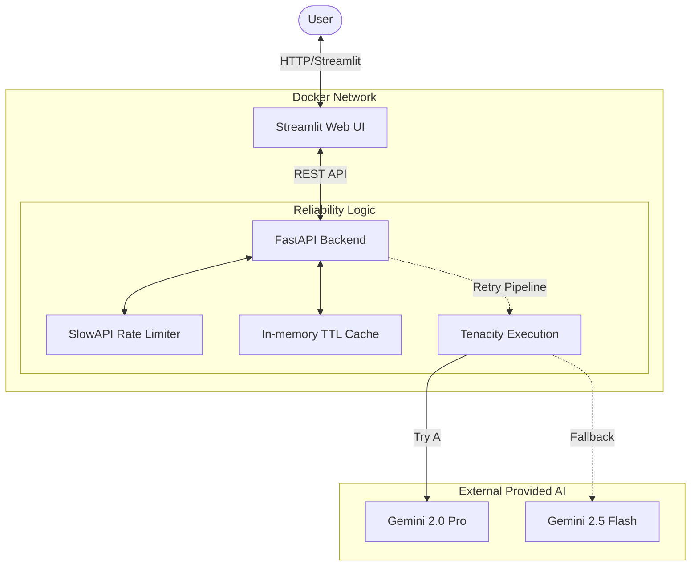

# 🚀 Productionized AI Assistant

This repository contains **Task 2: Productionize the AI Assistant**. It transforms the foundational AI backend into a robust, high-availability production application.

## ✨ Production Features Implemented

*   **📱 Web UI**: A beautiful, interactive frontend built with `Streamlit`.
*   **⚡ Performance Engineering**: 
    *   **Async Processing**: FastAPI and `asyncio` used to ensure the event loop is never blocked by LLM network calls.
    *   **Prompt/Response Caching**: `cachetools.TTLCache` implemented so duplicated queries hit the in-memory cache instantly without calling the LLM API.
*   **🛡️ Reliability Engineering**:
    *   **Rate Limiting**: `slowapi` restricts users to 10 requests per minute per IP to prevent abuse and API exhaustion.
    *   **Retry Pipeline**: `tenacity` wraps outgoing LLM requests with an Exponential Backoff strategy (up to 3 retries) for transient network failures.
    *   **Fallback Logic (Graceful Degradation)**: The system attempts to use a primary model (`gemini-2.0-pro`), but if it fails, it automatically degrades to a faster backup model (`gemini-2.5-flash`).
*   **🐳 Containerization**: Fully Dockerized with multi-container orchestration.

## 🏗️ Architecture Diagram



## 🧠 Model Optimization (ONNX Justification)

**Why ONNX wasn't used here:**
The requirement to convert a model to ONNX is highly applicable to *local, lightweight Neural Networks* (like small BERT classification models, or ResNet computer vision models) where we control the inference hardware and weights. 
Because this application is fundamentally powered by an immense, hosted mixture-of-experts model (Google Gemini) accessed via API, we physically do not possess the model weights, nor do we run the inference locally. Therefore, ONNX conversion is physically impossible and structurally inapplicable. Our "inference optimization" focuses instead on **network-layer optimizations** (Caching, Async execution, Batching patterns).

## 🚀 Deployment Instructions

### 1. Local Deployment (Docker Compose) - Recommended

1. Copy the `.env.template` file:
   ```bash
   cp .env.template .env
   ```
2. Insert your Google Gemini API Key into `.env`.
3. Build and launch the containers:
   ```bash
   docker-compose up --build -d
   ```
4. Access the UI at: **http://localhost:8501**
5. Access the Backend API Docs at: **http://localhost:8001/docs**

### 2. Manual Execution (Without Docker)

**Shell 1 (Backend):**
```bash
cd backend
python -m venv .venv && source .venv/bin/activate
pip install -r requirements.txt
export GEMINI_API_KEY="your-api-key"
python main.py
```

**Shell 2 (Frontend):**
```bash
cd frontend
python -m venv .venv && source .venv/bin/activate
pip install -r requirements.txt
streamlit run app.py
```

### 3. Cloud Deployment Strategy (e.g., AWS, GCP)
To deploy this architecture to the cloud:
1. **AWS ECS / Fargate:** Push the `frontend` and `backend` images to Amazon ECR. Create a Task Definition loading both containers, mapping port 8501 to an Application Load Balancer (ALB).
2. **GCP Cloud Run:** Deploy the backend Dockerfile as one Cloud Run service. Deploy the frontend Dockerfile as a second Cloud Run Service. Provide the backend's generated URL as the `BACKEND_URL` environment variable to the frontend instance. 
3. **Database swap:** For multi-node scalability, swap out the `cachetools` dictionary and local `slowapi` instance with a managed **Redis Cluster** (e.g., AWS ElastiCache) to share cache/rate hits across instances.
