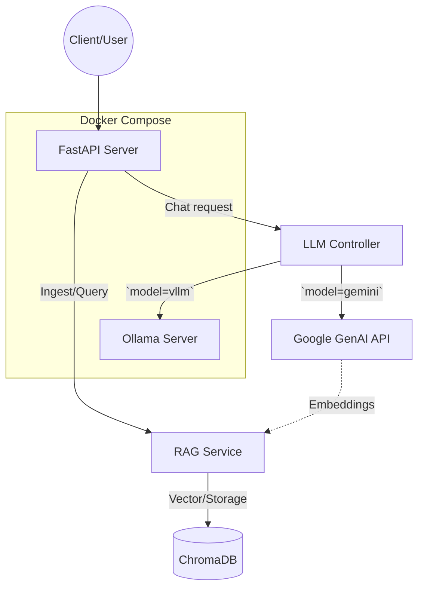

# AI Assistant (Applied AI)

This is a robust AI assistant that features Retrieval-Augmented Generation (RAG), Gemini API integration with tool calling and structured output, and local model deployment via Ollama.

## Architecture



## Features
- **RAG Pipeline**: Ingest TXT and PDF documents, chunked and vectorized using Gemini Embeddings and stored in ChromaDB.
- **LLM Integration**: Uses the new `google-genai` Python SDK to interact with Gemini-3.6-Flash.
- **Tool Calling**: Configured tools allow Gemini to trigger functions (e.g., fetching weather).
- **Structured Output**: Instruct the model to return strongly typed JSON via Pydantic schemas.
- **Local Deployment**: Serves a smaller open-source model using the `ollama/ollama` container image, accessible as a fallback backend via the `/chat` endpoint.

## Step-by-Step Guide to Run the Project

1. **Navigate to the Project Directory**:
   Open your terminal and navigate to the root of the project:
   ```bash
   cd task_1
   ```

2. **Configure Environment Variables**:
   Copy the provided `.env.template` to `.env` and add your Google Gemini API key:
   ```bash
   cp .env.template .env
   # Open .env and add your API key
   ```

3. **Build and Start the Containers**:
   Ensure Docker is running, then execute:
   ```bash
   docker compose up --build -d
   ```
   > **Note on Local Model Support**: The `docker-compose.yml` runs an Ollama container and automatically pulls a lightweight model (`qwen2.5:0.5b`). This is extremely fast and natively supports CPU inference without requiring a GPU.

4. **Verify the Deployment**:
   Check if the API is running by visiting the interactive Swagger documentation:
   [http://localhost:8000/docs](http://localhost:8000/docs)
   From here, you can directly test all the API endpoints directly from your browser.

5. **Stopping the Application**:
   When you are finished testing, gracefully shut down the services:
   ```bash
   docker compose down
   ```

## Usecases

This AI Assistant is designed to be versatile, supporting several core applied AI workflows:

### 1. Document Q&A (RAG Pipeline)
**Scenario**: You have a large PDF manual, policy document, or text file and need to ask specific questions without reading the entire document.
- **How to use**: 
  1. Upload your PDF via the `POST /api/v1/ingest/file` endpoint. The backend extracts the text, splits it into chunks, vectorizes it using Gemini embeddings, and stores it persistently in ChromaDB.
  2. Send a query to `POST /api/v1/chat` with `"use_rag": true`. The assistant searches the vector database, retrieves the most relevant paragraphs, and formulates a precise answer based on your document.

### 2. Dynamic Tool Execution
**Scenario**: You want the AI to fetch real-world data or interact with external services dynamically before answering.
- **How to use**: Ask the assistant a question like "What is the weather like in New York?" via the `POST /api/v1/chat` endpoint. The assistant evaluates its registered tools, automatically triggers the `get_current_weather` function, and incorporates the tool's result into its final response to you.

### 3. Structured Data Extraction (JSON Outputs)
**Scenario**: You are integrating the LLM into a larger application pipeline and need the AI to return data in a predictable, strictly typed format rather than conversational text.
- **How to use**: Send a prompt to `POST /api/v1/chat` (e.g., "Give me a recipe for pancakes") and set `"structured_output": true`. The API instructs Gemini to strictly adhere to a predefined Pydantic schema (`RecipeExtraction`), returning a pristine JSON object containing keys like `recipe_name`, `ingredients`, and `prep_time_minutes`.

### 4. Local Open-Source Model Fallback
**Scenario**: You want to query an AI model without sending data to an external provider, either to save on API costs or maintain privacy.
- **How to use**: Send a request to `POST /api/v1/chat` and set `"model_type": "vllm"`. The FastAPI server will bypass Gemini entirely and route your request to the local Ollama container serving an open-source model.
