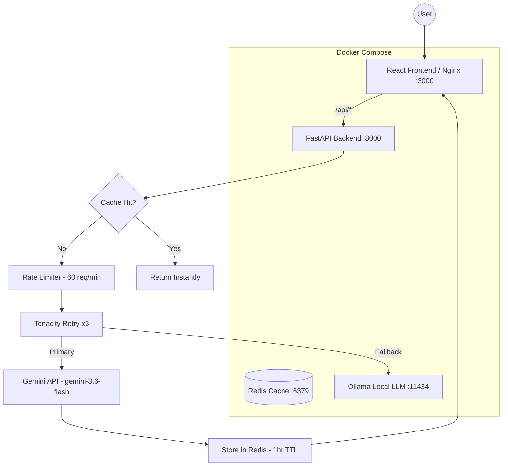

# AI Assistant — Task 2: Production-Grade

A fully production-ready AI assistant built on top of Task 1, adding reliability, performance engineering, and a proper React frontend.

## Architecture



## Production Features

| Concern | Implementation |
|---|---|
| **Web UI** | React + Vite (served by Nginx) |
| **Async Concurrency** | FastAPI async endpoints + Uvicorn 4 workers |
| **Response Caching** | Redis — SHA256 cache key, 1-hour TTL |
| **Retry Mechanism** | `tenacity` — 3 attempts, exponential backoff |
| **Rate Limiting** | `slowapi` — 60 requests/minute per IP |
| **Fallback Provider** | Gemini → Ollama `qwen2.5:0.5b` on exhausted retries |
| **Error Handling** | Graceful degradation; never returns raw stack traces |
| **Health Check** | `GET /api/v1/health` reports Redis + Ollama status |
| **ONNX** | Not applicable (Gemini is a cloud API; no weights available) |

## Step-by-Step: Running the Project

1. **Navigate to the project directory:**
   ```bash
   cd task_2
   ```

2. **Set up environment variables:**
   ```bash
   cp .env.template .env
   # Open .env and add your GEMINI_API_KEY
   ```

3. **Build and start all services:**
   ```bash
   docker compose up --build -d
   ```
   > This will build the React frontend (multi-stage Docker build), the FastAPI backend, and pull the `qwen2.5:0.5b` Ollama model. Allow ~2 minutes on the first run.

4. **Access the application:**
   - **Frontend UI:** [http://localhost:3000](http://localhost:3000)
   - **API Docs (Swagger):** [http://localhost:8000/docs](http://localhost:8000/docs)
   - **Health Check:** [http://localhost:8000/api/v1/health](http://localhost:8000/api/v1/health)

5. **Stop everything:**
   ```bash
   docker compose down
   ```

## Testing Key Features

### Caching
Send the same message twice. The second response will have `"cache_hit": true` in the API response and will be near-instant. The UI shows an `⚡ cached` badge on cached responses.

### Rate Limiting
Send more than 60 requests per minute from the same IP. The API will return `HTTP 429 Too Many Requests`. The UI shows a friendly message.

### Fallback
To test fallback, temporarily set an invalid `GEMINI_API_KEY` in `.env` and restart the backend. The API will retry 3 times, then gracefully fall back to Ollama and return a response with `"fallback_used": true` and a `⚠ fallback` badge in the UI.

### Health Check
```bash
curl http://localhost:8000/api/v1/health
# Returns: {"status": "healthy", "redis": "up", "ollama": "up"}
```
