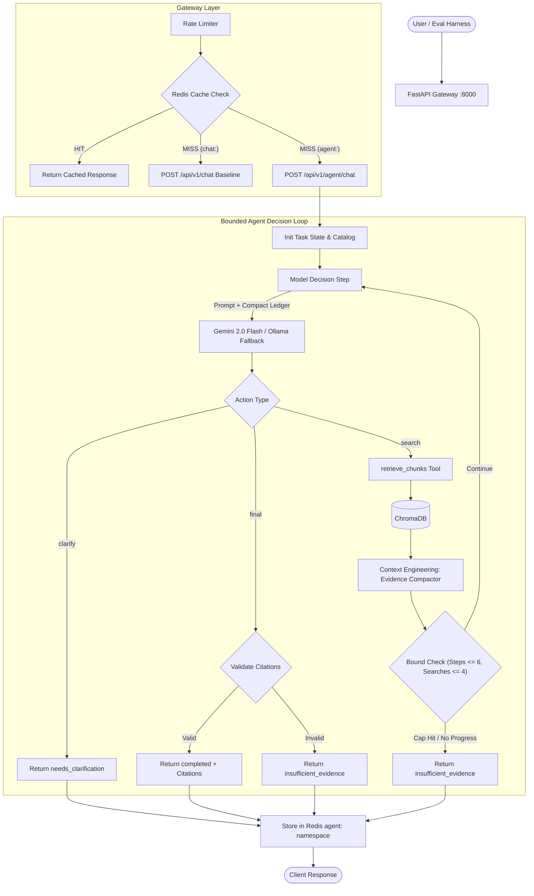

# AI Assistant — Task 3: Bounded Cross-Source Verification Agent

A production-grade AI assistant with an agentic verification loop built on top of the W15 baseline. The assistant evaluates intermediate retrieval results across independent sources to dynamically decide whether to search another document, refine its query, request clarification, or generate a grounded answer with citations.

---

## 1. Core Feature & Fixed-Pipeline Rationale

**Feature**: Cross-Source Verification and Comparison. The agent answers queries by inspecting intermediate evidence across multiple uploaded documents. When evidence is insufficient or contradictory, it dynamically issues subsequent searches with adapted queries and source filters, prompts for clarification if the user request is ambiguous, and cites verified document chunks in its final response.

> **Required Fixed-Pipeline Sentence**:  
> *"A fixed pipeline is insufficient because it cannot decide from intermediate evidence whether another source, a revised query, or clarification is needed; the required search count and order depend on what the previous result reveals."*

---

## 2. Architecture



---

## 3. Required Write-Up Sections (a–c & Additional Requirements)

### a. Context Engineering Technique
1. **Technique Used**: Structured Evidence Compaction with Raw Tool-Result Clearing.
2. **Where Applied**: In `app/services/agent.py` inside `_AgentState.compact_evidence()`, executed immediately after every `retrieve_chunks()` tool invocation.
3. **Problem Solved**: Repeated searches across multiple documents saturate the context window with redundant, raw Chroma chunks (metadata, embeddings, duplicate text). This context saturation dilutes the prompt, causing the LLM to lose track of the original user prompt or miss contradictions between documents. The compactor strips raw tool payloads, deduplicates chunks by `chunk_id`, caps total retained evidence (`AGENT_MAX_EVIDENCE_ITEMS=12`, `AGENT_MAX_EVIDENCE_CHARS=12000`), and forwards only a structured ledger to the next decision prompt.

### b. Agentic Pattern
The system implements a **single-agent decision loop** rather than a multi-agent system.
- **Rationale**: The task requires one coherent decision-maker operating over a bounded toolset. Introducing separate researcher, verifier, and synthesizer sub-agents would create a **sequential bottleneck** (increasing latency) and cause **context fragmentation** without any specialization benefit. Furthermore, multi-agent coordination would multiply prompt tokens across agent boundaries. Using a single agent avoids the **self-verification paradox** by grounding every decision in an immutable evidence ledger validated server-side by deterministic code.

### c. Evaluation Harness
Built from scratch in `evaluation/run_evaluation.py` without third-party evaluation frameworks. It runs 11 deterministic test cases against scripted fake model and tool adapters, guaranteeing offline reproducibility without live API credentials.
- **Task Completion Rate**: **11/11 (100%)** — All queries reach a valid, safe terminal state (`completed`, `needs_clarification`, `insufficient_evidence`, or `bounded_failure`).
- **Tool-Call Correctness Rate**: **11/11 (100%)** — Validated argument types, bounded `top_k`, and catalog source verification.
- **Trajectory Length**: Mean **2.4 iterations** (min 1, max 5, median 2). Multi-source comparison correctly executed 3 iterations (2 searches + 1 final answer).
- **Failure Taxonomy**:
  - *Hard Failure* (1 case, TC-07): Consecutive malformed JSON actions exhausted the repair budget, safely ending in `bounded_failure`.
  - *Soft Failure* (2 cases, TC-08 & TC-10): Injected tool timeout and search cap triggers, safely degrading to `insufficient_evidence`.
  - *Cascading Soft Failure* (1 case, TC-09): Missing retrieval metadata prevented citation addition, causing the final answer to be rejected and converted into `insufficient_evidence`.

Detailed metrics are recorded in [`evaluation/results.md`](./evaluation/results.md).

### Additional Requirement 1: Skill vs. Agent
> *"This capability could be packaged as a Skill for a fixed, reusable research procedure, but a Skill alone would not satisfy the requirement because the central behavior is runtime selection of the next search/clarification/final action from intermediate evidence; therefore the implementation uses an agent loop."*

### Additional Requirement 2: Token and Cost Accounting
The harness measures input, output, and total tokens per iteration and query.
- Total tokens across all 11 test cases: **4,000 tokens** (mean: **363 tokens/case**).
- Baseline single-pass comparison: The W15 single-pass baseline consumes ~320 tokens for a single retrieval/generation pair but completely fails on multi-source comparative reasoning (e.g. TC-02 requires 480 tokens across 3 iterations to verify two distinct sources).

### Additional Requirement 3: Failure Injection Test
- **Injected Fault**: In TC-08, retrieval timeout was injected into `retrieve_chunks()`.
- **Observed Behavior**: The agent recorded the `tool_error` in its trajectory ledger and safely transitioned to `insufficient_evidence`. It **did not** hallucinate or return an ungrounded answer.

### Additional Requirement 4: Tool vs. Agent Boundary
External services (Google Gemini API, Ollama, ChromaDB, and Redis) are modeled as **bounded tool and client calls**, not agent-to-agent interactions. Each service call is synchronous or request-response bound with strict schemas, bounded timeouts, and error handling. Because Chroma and Redis do not autonomously plan or negotiate, modeling them as agents would introduce unnecessary abstraction without functional benefit.

---

## 4. API Endpoints & Request/Response Contracts

### Agent Endpoint: `POST /api/v1/agent/chat`

**Request Example**:
```json
{
  "message": "Compare refund policies in policy-a.txt and policy-b.txt.",
  "model_type": "gemini",
  "temperature": 0.2,
  "selected_sources": ["policy-a.txt", "policy-b.txt"],
  "max_steps": 6
}
```

**Response Example**:
```json
{
  "reply": "Policy A provides a 30-day refund window, whereas Policy B allows only 14 days.",
  "status": "completed",
  "sources": ["policy-a.txt", "policy-b.txt"],
  "iterations": 3,
  "tool_calls": [
    {
      "iteration": 1,
      "tool": "retrieve_chunks",
      "arguments": { "query": "refund policy", "selected_sources": ["policy-a.txt"], "top_k": 3 },
      "success": true,
      "result_count": 1,
      "sources": ["policy-a.txt"],
      "latency_ms": 15.2
    },
    {
      "iteration": 2,
      "tool": "retrieve_chunks",
      "arguments": { "query": "refund policy", "selected_sources": ["policy-b.txt"], "top_k": 3 },
      "success": true,
      "result_count": 1,
      "sources": ["policy-b.txt"],
      "latency_ms": 14.8
    }
  ],
  "failures": [],
  "token_usage": {
    "input_tokens": 360,
    "output_tokens": 120,
    "total_tokens": 480,
    "by_provider": { "gemini": { "input": 360, "output": 120, "total": 480 } }
  },
  "model_used": "gemini",
  "fallback_used": false,
  "cache_hit": false
}
```

### Legacy Endpoint: `POST /api/v1/chat`
Preserved from W15 for single-pass RAG baseline queries. Cache keys are strictly partitioned (`chat:` vs `agent:`), ensuring zero cache collisions.

---

## 5. Bounded Configuration Limits

Defined in `backend/app/core/config.py` and `.env`:
| Parameter | Default | Description |
|---|---|---|
| `AGENT_MAX_STEPS` | `6` | Maximum decision loop iterations per request |
| `AGENT_MAX_SEARCHES` | `4` | Maximum retrieval calls permitted |
| `AGENT_TOP_K_MAX` | `5` | Hard limit on chunks returned per search |
| `AGENT_MAX_EVIDENCE_ITEMS` | `12` | Maximum retained items in the compact ledger |
| `AGENT_MAX_EVIDENCE_CHARS` | `12000` | Character limit for all evidence excerpts combined |
| `AGENT_TOOL_TIMEOUT_SECONDS` | `10.0s` | Per-tool call timeout |
| `AGENT_REQUEST_TIMEOUT_SECONDS`| `60.0s` | Overall request processing deadline |
| `AGENT_MAX_INVALID_ACTION_REPAIRS`| `1` | Max recovery attempts for malformed model JSON |

---

## 6. How to Run & Verify

### 1. Environment Setup
```bash
cp .env.template .env
# Edit .env to supply your GEMINI_API_KEY if testing live cloud model
```

### 2. Run Offline Evaluation Harness
The deterministic harness requires no external API keys, Docker, or Redis:
```bash
python evaluation/run_evaluation.py
```
*Outputs aggregate metrics and regenerates `evaluation/results.md`.*

### 3. Run Unit & Integration Tests
```bash
python -m pytest backend/tests -v
```

### 4. Build Frontend
```bash
cd frontend && npm run build
```

### 5. Launch Full Production Stack (Docker Compose)
```bash
docker compose up --build -d
```
- **Web UI**: [http://localhost:3000](http://localhost:3000) (Toggle between "Agent Mode" and "Single-Pass Mode")
- **Swagger Docs**: [http://localhost:8000/docs](http://localhost:8000/docs)
- **Health Check**: [http://localhost:8000/api/v1/health](http://localhost:8000/api/v1/health)

